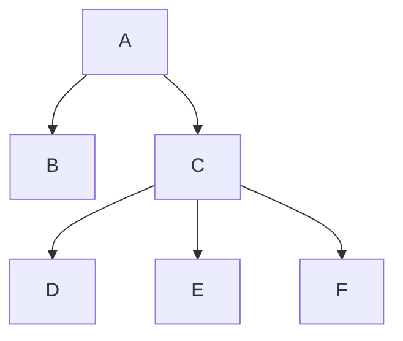
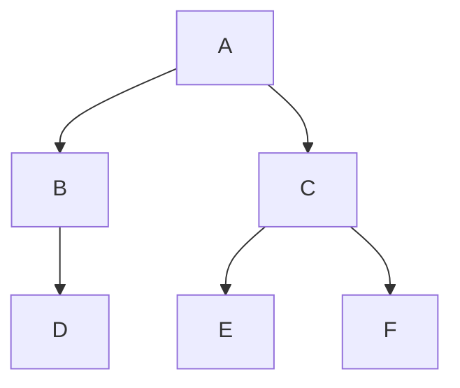

# LASD

## introduzione alle librerie

Il corso chiede 3(4) esercizi da consegnare, ognuno per gestire diverse strutture dati che seguono una gerarchia precisa:

La gerarchia delle classi verrà elencata in ordine crescente, dalla più generica alla più specifica. Per ogni classe poi sarà mostrata la sua ereditarietà ed elencata ogni funzione.

Per ogni struttura concreta vanno implementate i seguenti metodi:

1. costruzione e distruzione di una struttura dati;
2. operazioni di assegnamento e confronto tra istanze diverse della specifica struttura;
3. test di vuotezza (bool Empty());
4. lettura della dimensione;
5. svuotamento della struttura;
6. controllo di esistenza di un dato valore.

Ogni struttura avrà poi dei metodi specifici.

---

# esercizio 0

Questa libreria si occuppa di implementare le strutture astratte, che quindi non possono essere istanziate dall’utente e che definiscono il livello alto della gerachia.

## Container

La struttura più generica in assoluto. Ha solo un attributo size che indica la dimensione.

Empty(): verifica se la struttura è vuota o meno.

```cpp
virtual bool Empty() const noexcept { return size == 0; }
```

Size(): restituisce la dimensione della struttura.

```cpp
virtual ulong Size() const noexcept { return size; }
```

---

### ClearableContainer

  **: virtual public Container**

Contenitore con la possibilità di essere svuotato.

Clear(): svuota la struttura.

```cpp
virtual void Clear() { size = 0; }
```

---

### ResizibleContainer

  **: virtual public ClearableContainer**

Contenitore che possono anche essere ridimensionato.

Resize(): ridimensiona la struttura.

```cpp
virtual void Resize(ulong newSize) { size = newSize; }
```

---

### TestableContainer

  **: virtual public Container**

Contenitore con la possibilità di verificare l’esistenza di un dato all’interno.

Exists(): verifica la presenza di un elemento.

```cpp
virtual bool Exists(const Data&) const noexcept = 0;
```

---

## TraversableContainer

  **: virtual public TestableContainer**

Questa famiglia di contenitori possono essere visitati attraverso una funzione apposita.

All’interno del file sono presenti altre classi che si occupano della visita in un determinato ordine (Pre, Post, In, Breadth).

Traverse(): attraversamento della struttura.

```cpp
using TraverseFun = std::function<void(const Data&)>;
virtual void Traverse(TraverseFun) const = 0;
```

Fold(): accumulazione di un valore.

```cpp
Accumulator Fold(FoldFun<Accumulator> fun, Accumulator acc) const {
        
    Traverse([fun, &acc](const Data& d) {  acc = fun(d, acc); });
    return acc;
}
```

---

### MappableContainer

  **: virtual public TraversableContainer**

Identica alla classe Traversable permette in più di manipolare i dati, che quindi non saranno costanti: in altre parole potranno essere passate funzioni che possono alterare i valori dei dati, ma anche banalmente rimuoverli dalla struttura.

Map(): attraversamento manipolabile della struttura.

```cpp
using MapFun = std::function<void(Data&)>;
virtual void Map(MapFun) = 0;
```

---

## LinearContainer

  **:** **virtual public PreOrderMappableContainer**

  **,** **virtual public PostOrderMappableContainer**

Contenitori i cui dati sono ordinati linearmente e che possono quindi avere un indice. Nel file di Linear è presente anche la classe SortableLinearContainer che estende LinearContainer e contiene in più una funzione Sort() implementata come QuickSort().

Front(): restituisce il primo elemento della struttura.

```cpp
Data& Front() {

    if (size != 0) { return operator[](0); }
    else { throw std::length_error("trying acess to an empty container."); }
}
```

Back(): restituisce l’ultimo elemento della struttura.

```cpp
Data& Back() {

    if (size != 0) { return operator[](size - 1); }
    else { throw std::length_error("trying acess to an empty container."); }
}
```

Traverse() *@override*

```cpp
inline void Traverse(TraverseFun fun) const {
    
    for (ulong i = 0; i < size; i++) { fun(operator[](i)); }
}
```

---

## DictionaryContainer

  **: virtual public TestableContainer**

Un dizionario è un tipo di struttura su cui possono essere effettuate solo 3 operazioni: inserimento, cancellazione e ricerca. Tutte le funzioni per inserimenti e cancellazioni hanno come tipo di ritorno un valore booleano per verificare se dati sono stati correttamente inseriti/rimossi o meno.

Insert(): inserimento di un elemento. Il corpo non viene implementato a questo livello.

Remove(): rimozione di un elemento. Idem.

InsertAll(): inserimento di elementi di un’altra struttura.

```cpp
bool InsertAll(MappableContainer<Data>&& cntr) {

    bool allInserted = true;
    cntr.Map([this, &allInserted](Data& d) { allInserted &= Insert(std::move(d)); });
    return allInserted;
}
```

RemoveAll(): rimozione di elementi di un’altra struttura.

```cpp
bool RemoveAll(const TraversableContainer<Data>& cntr) {

    bool allRemoved = true;
    cntr.Traverse([this, &allRemoved](const Data& d) { allRemoved &= Remove(d); });
    return allRemoved;
}
```

# esercizio 1

In questa libreria verranno implementate le prime 4 strutture dati concrete.

## Vector

  **: virtual public ResizibleContainer**

  **, virtual public LinearContainer**

Un vettore è una struttura che contiene elementi dello stesso tipo identificati da un indice.

La maggior parte delle funzioni di Vector sono gia state implementate in LinearContainer, quindi non è necessario riscriverle. Vector ha anche la possibilità di essere ridimensionato.

Come in Linear anche nel file di Vector è presente una versione ordinabile SortableVector, che estende sia Vector sia SortableLinearContainer e che quindi non ha bisogno di implementare nessun metodo.

La classe Vector ha un attributo protected `elements` dichiarato (dinamicamente) come un array.

Clear() *@override*

```cpp
void Clear() {
    
    delete[] elements;
    elements = nullptr;
    size = 0;
}
```

Resize() *@override*

```cpp
void Resize(ulong newSize) {

    if (newSize == 0) { Clear(); }

    if (size != newSize) {
        
        Data* tmpEl = new Data[newSize];
        ulong minSize = std::min(size, newSize);
        
        for (ulong i = 0; i < minSize; i++) { std::swap(elements[i], tmpEl[i]); }
        
        size = newSize;
        std::swap(elements, tmpEl);
        delete[] tmpEl;
    }
}
```

---

## List

  **: virtual public ClearableContainer**

  **, virtual public LinearContainer**

  **, virtual public DictionaryContainer**

Una lista è una successione finita di valori dello stesso tipo. A differenza di un vettore, la lista è implementata come una sequenza di nodi collegati tra loro tramite puntatori. Ogni nodo infatti è una struct con una coppia valore - puntatore al prossimo nodo.

La classe List ha due attributi protected `head` e `tail` di tipo Node*.

InsertAtFront(): inserimento in testa.

```cpp
void InsertAtFront(Data&& d) {

    Node* nd = new Node(std::move(d));
    nd->next = head;
    head = nd;
    size++;
    
    if (tail == nullptr) { tail = head; }
}
```

InsertAtBack(): inserimento in coda.

```cpp
void InsertAtBack(Data&& d) {
      
    Node* nd = new Node(std::move(d));
    
    if (tail == nullptr) { 
        
        tail = head = nd;
    
    } else { 
        
        tail->next = nd;
        tail = tail->next;
    }

    size++;
}
```

RemoveFromFront(): rimozione in testa.

```cpp
void RemoveFromFront() {
    
    if (head != nullptr) {
        
        Node* nd = head;
        
        if (tail == head) { head = tail = nullptr; }
        else { head = head->next; }
        
        size--;
        nd->next = nullptr;
        delete nd;
    
    } else { throw std::length_error("trying access to an empty list."); }
}
```

FrontNRemove(): accesso e rimozione in testa.

```cpp
Data FrontNRemove() {

    if (head != nullptr) {
        
        Node* nd = head;
        
        if (tail == head) { head = tail = nullptr; }
        else { head = head->next; }
        
        size--;
        nd->next = nullptr;
        Data d(std::move(nd->element));
        delete nd;
        return d;

    } else { throw std::length_error("trying access to an empty list."); }
}
```

Insert() *@override*

```cpp
bool Insert(Data&& d) {
        
    for (Node* nd = head; nd != nullptr; nd = nd->next) { 
		    if (nd->element == d) return false;
		 }

    InsertAtBack(std::move(d));
    return true; 
}
```

Remove() *@override*

```cpp
bool Remove(const Data& d) {

    Node* lst = nullptr;
    
    for (Node** nd = &head; *nd != nullptr; lst = *nd, nd = &((*nd)->next)) {
        
        if ((*nd)->element == d) {
            
            Node* nd2 = *nd;
            *nd = nd2->next;
            
            nd2->next = nullptr;
            delete nd2;
            size--;
            
            if (tail == nd2) { tail = lst; }
            
            return true;
        }
    }
    
    return false;
}
```

Traverse() *@override*

```cpp
void Traverse(TraverseFun fun) const {
      
		for (Node* nd = head; nd != nullptr; nd = nd->next) { fun(nd->element); }
}
```

PostOrderTraverse() *@override*

```cpp
void PostOrderTraverse(TraverseFun fun) const override { PostOrderTraverse(fun, head); }

void PostOrderTraverse(TraverseFun fun, const Node* nd) const {

    if (nd != nullptr) {
        
        PostOrderTraverse(fun, nd->next);
        fun(nd->element);
    }
}
```

Clear() *@override*

```cpp
void Clear() {

    delete head;
    head = tail = nullptr;
    size = 0;
}
```

---

## Stack

  **: virtual public ClearableContainer**

Uno stack è una struttura dati dinamica che funziona come una pila di
piatti: è possibile aggiungere e rimuovere elementi solo in/dalla cima,
quindi l'ultimo elemento ad essere inserito sarà il primo ad essere
rimosso.

Di conseguenza le due operazioni fondamentali saranno Push per
aggiungere un elemento in cima, e Pop per rimuovere un'elemento dalla cima,
LIFO (Last In First Out).

L'esercizio propone di implementare uno stack sia come vettore che come
lista, tuttavia poiché si vuole fare in modo di poter accedere solo ai
metodi di stack, per la prima volta l'ereditarietà con Vector e List sarà
protetta. I metodi richiesti dello stack sono: 

- Top() costante e non;
- Push() costante e non;
- Pop();
- TopNPop().

### StackLst

  **: virtual public Stack**

  **: virtual protected List**

In questo caso l'implementazione dei metodi dello stack è parecchio
semplice, poiché List dispone gia di tutte le funzioni sufficienti:

- Top() che restituisce la cima dello stack è implementato restituendo
banalmente la funzione Front();
- Push() che inserisce in cima è definita tramite InsertAtFront();
- Pop() che rimuove la cima è definita tramite RemoveFromFront();
- TopNPop() che restituisce la cima e poi la toglie dalla struttura è definita tramite FrontNRemove().

### StackVec

  **: virtual public Stack**

  **: virtual protected Vector**

In questo caso invece le cose sono un poco più complicate, poiché la dimensione di un vettore è prefissata: è comunque possibile ridimensionarlo, ma è un'operazione che dovrebbe essere fatta poche volte anziché ad ogni
inserimento per evitare di copiare ogni volta tutti i valori e rendere troppo inefficiente la struttura.

Si suggerisce dunque di creare un vettore già abbastanza grande, e di raddopiarne la dimensione una volta che è completamente riempito.

StackVec ha un attributo ulong head che indica l’indice della testa: infatti mentre con size è possibile risalire a quanti elementi può contenere lo stack (visto che è implementato come vettore) head in altre parole tiene traccia di quanti invece sono stati effettivamente inseriti.

Top() *@override*

```cpp
Data& Top() {
    
    if (head != 0) { return elements[head - 1]; }
    else { throw std::length_error("access to an empty stack."); }
}
```

Push() *@override*

```cpp
void Push(Data&& d) {
      
    if (head == size) { Resize(size * 2); }
    elements[head++] = std::move(d);
}
```

Pop() *@override*

```cpp
void StackVec<Data>::Pop() {
        
    if (head != 0) { if (--head < size / 4) { Resize(size / 2); } }
    else { throw std::length_error("access to an empty stack."); }
}
```

TopNPop() *@override*

```cpp
Data TopNPop() {
      
    Data topEl { Top() };
    Pop();
    return topEl;
}
```

---

## Queue

  **: virtual public ClearableContainer**

La coda è un'insieme dinamico in cui a differenza dello stack, quando viene
chiamata una cancellazione viene rimosso il primo elemento inserito, quello
più vecchio, FIFO (First In First Out).
Anche in questo caso l'implementazione della Queue e dei suoi metodi è
fatta sia tramite vettore che lista, e i metodi richiesti sono del tutto analoghi a quelli dello stack:

- Head() costante e non;
- Enqueue() costante e non;
- Dequeue();
- HeadNDequeue().

### QueueLst

  **: virtual public Queue**

  **: virtual protected List**

Come per lo StackLst l'implementazione di una coda come una lista è molto
facile perché gia di per sé la lista possiede metodi già pronti:

- Head() che restituisce la testa della coda è implementato restituendo
banalmente la funzione Front();
- Enqueue() che inserisce in coda è definita tramite InsertAtBack();
- Dequeue() che rimuove la testa è definita tramite RemoveFromFront();
- HeadNDequeue() che restituisce la testa e poi la toglie dalla struttura è definita tramite FrontNRemove().

### QueueVec

  **: virtual public Queue**

  **: virtual protected Vector**

E come per lo StackVec, questo caso è più complesso.
Innanzitutto il vettore non verrà rappresentato linearmente, ma in modo
circolare: l'idea è quella di avere una struttura che rappresenta i dati
come se fosse chiusa su se stessa, e per fare ciò è necessario l'uso di due
indici, uno per la testa e uno per la coda. Potrebbe tornare utile lasciare
un terzo indice tra testa e coda vuoto per gestire in modo più semplice la
saturazione del vettore.
Questa gestione ovviamente implica un modo diverso per espandere e ridurre
il vettore rispetto allo stack, perché non per forza l'indice della coda si
trova all'ultimo elemento.

QueueVec ha come detto due attributi head e tail per gli indici di rispettivame l’elemento prossimo alla rimozione e quello appena inserito. Inoltre un terzo attributo numElem è utile per tenere traccia del numero di elementi effettivamente presenti.

Head() *@override*

```cpp
Data& QueueVec<Data>::Head() {

    if (numElem != 0) { return elements[head]; }
    else { throw std::length_error("trying access to an empty queue."); }
}
```

Enqueue() *@override*

```cpp
void Enqueue(Data&& d) {

    if (numElem == size) { Resize(size * 2); }

    elements[tail] = std::move(d);
    ++tail %= size;
    ++numElem;
}
```

Dequeue() *@override*

```cpp
void Dequeue() {

    if (numElem != 0) {
        
        ++head %= size;
        if (--numElem < size / 4) Resize(size / 2);
        
    } else { throw std::length_error("trying access to an empty queue."); }
}
```

HeadNDequeue() *@override*

```cpp
Data HeadNDequeue() {
        
    Data headEl = Head();
    Dequeue();
    return headEl;
}
```


# esercizio 2

In questo esercizio vanno implementate due strutture: albero binario e albero binario di ricerca.

Un albero è un grafo che deve rispettare alcune caratteristiche:

- connesso: non esistono nodi vacanti, non connessi da nessun arco;
- non orientato: gli archi non hanno una direzione, e di conseguenza due archi distinti non possono connettere due stessi nodi;
- senza cicli: non deve contenere percorsi che iniziano e finiscono nello stesso nodo.

Per informazioni sui grafi consultare gli appunti dalla pagina di lasd.

In particolare in informatica un albero è una struttura dati che si rifà al concetto di albero con radice presente nella teoria dei grafi.



Una radice è un nodo con queste proprietà:

- è unica, in un albero c’è una e solo una radice;
- non ha archi entranti, ovvero non ha genitori;
- partendo dalla radice, ogni nodo dell'albero può essere raggiunto da esattamente un percorso.

Ed ogni albero ha almeno una foglia, un nodo senza archi uscenti, quindi senza figli (nell’esempio sono foglie i nodi B, D, E ed F).

I metodi da implementare specifici per le due strutture dati sono:

1. operazioni di attraversamento della struttura (Traverse());
2. operazioni di accumulaizone di un valore (Fold());
3. interrogazione delle proprietà di un nodo quali:
- accesso in lettura/scrittura al dato;
- controllo di esistenza;
- accesso al figlio sinistro/destro;
1. navigazione per mezzo di iteratori.

## Iterator

Un iteratore è una classe che tramite i suoi operatori consente di visitare tutti gli elementi contenuti in un altro oggetto (in questo caso alberi), in modo iterativo.

Questa classe, come i suoi figli diretti, per il momento è astratta (come anche i metodi) e le versioni concrete verranno implementate nel file di binary tree.

Esiste anche una versione Mutable identica contenuta nello stesso file.

const Data& operator*(): si occupa di accedere all’elemento corrente dell’iterazione.

### ForwardIterator

  **: virtual public Iterator**

Questa classe si occupa dell’iterazione vera e propria grazie al suo unico operatore.

ForwardIterator& operator++(): questo operatore sarà il core dell’iterazione, si occuperà infatti di avanzare al prossimo elemento dell’albero (ovviamente rispettando l’ordine richiesto).

### ResettableIterator

  **: virtual public Iterator**

Questo iteratore ha un’unica funzione che si occupa di resettare l’iterazione, quindi ritornare al primo elemento (la radice).

void Reset(): funzione per resettare l’iterazione.

---

## BinaryTree

  **: virtual public PreOrderTraversableContainer**

  **, virtual public PostOderTraversableContainer**

  **, virtual public InOrderTraversableContainer**

  **, virtual public BreadthTraversableContainer**

Un albero binario è un tipo di albero in cui ogni nodo ha al massimo due figli, uno sinistro e uno destro. È molto utile avere anche una definizione ricorsiva, dal momento che gli alberi in generale funzionano molto bene con la ricorsione: un albero binario è un insieme che o è vuoto o composto a sua volta da 3 sottoinsieme disgiunti:

- un insieme di cardinalità uno, che contiene la radice;
- un sottoalbero sinistro;
- un sottoalbero destro.

La classe binary tree in sé è astratta, verrà implementata successivamente usando le funzionalità di un vettore e di una lista come per stack e queue.

L’unica funzionalità specifica degli alberi binari da implementare è l’attraversamento per applicare una funzione a tutti gli elementi (Traverse() & Map()) in tutti gli ordini possibili.

Le funzioni pubbliche di Traverse richiamano tutte il rispettivo overload ausiliario per permettere la ricorsione, inoltre la Traverse() semplice richiama PreOrderTraverse().

All’interno del file c’è la classe MutableBinaryTree, che si occupa appunto della visita Mutable e che verrà tralasciata in quanto identica alla prima.

Le Map() infatti poiché sono identiche a quelle di Traverse() usano uno static_cast per poter utilizzare già quelle senza il bisogno di riscrivere codice, come verrà mostrato.



PreOrderTraverse() *@override*

```cpp
void PreOrderTraverse(TraverseFun fun, const Node& nd) const {

    fun(nd.Element());
    if (nd.HasLeftChild()) { PreOrderTraverse(fun, nd.LeftChild()); }
    if (nd.HasRightChild()) { PreOrderTraverse(fun, nd.RightChild()); }
}
```

PostOrderTraverse() *@override*

```cpp
void PostOrderTraverse(TraverseFun fun, const Node& nd) const {

    if (nd.HasLeftChild()) { PreOrderTraverse(fun, nd.LeftChild()); }
    if (nd.HasRightChild()) { PreOrderTraverse(fun, nd.RightChild()); }
    fun(nd.Element());
}
```

InOrderTraverse() *@override*

```cpp
void InOrderTraverse(TraverseFun fun, const Node& nd) const {

    if (nd.HasLeftChild()) { PreOrderTraverse(fun, nd.LeftChild()); }
    fun(nd.Element());
    if (nd.HasRightChild()) { PreOrderTraverse(fun, nd.RightChild()); }
}
```

BreadthTraverse() *@override*

```cpp
void BreadthTraverse(TraverseFun fun, const Node& nd) const {

    QueueLst<Node const*> que;
    que.Enqueue(&nd);

    while (!que.Empty()) {
        
        if (que.Head()->HasLeftChild()) { que.Enqueue(&que.Head()->LeftChild()); }
        if (que.Head()->HasRightChild()) { que.Enqueue(&que.Head()->RightChild()); }
        fun(que.HeadNDequeue()->Element());
    }
}
```

Map() *@override*

```cpp
void Map(MapFun fun) {
        
    TraverseFun tFun = [&fun](const Data& d) { fun(const_cast<Data&>(d)); };

    static_cast<const MutableBinaryTree<Data>*>(this)->Traverse(tFun);
}
```

---

### BTPreOrderIterator

  **: virtual public ForwardIterator**

  **, virtual public ResettableIterator**

Da qui iniziano le implementazioni concrete degli iteratori, una versione per ogni tipo di visita. Verranno omesse le classi Mutable in quanto identiche.

Gli attributi di questa classe sono uno StackVec<Node const*> stk, due Node const* root e cur, quest’ultimo terrà traccia dell’elemento corrente dell’iterazione.

operator*() *@override*

```cpp
const Data& operator*() const {
        
    if (cur != nullptr) { return cur->Element(); }
    
    else { throw out_of_range("The iterator is terminated."); }
}
```

operator++() *@override*

```cpp
ForwardIterator& operator++() {

    if (Terminated()) { throw std::out_of_range("The iterator is terminated."); }

    if (cur->HasRightChild()) { stk.Push(&(cur->RightChild())); }
    
    if (cur->HasLeftChild()) { stk.Push(&(cur->LeftChild())); }

    if (stk.Empty()) { cur = nullptr; }
    else { cur = stk.TopNPop(); }
    
    return *this;
}
```

Reset() *@override*

```cpp
void Reset() noexcept {

    stk.Clear();
    
    if (root != nullptr) { cur = root; }
}
```

---

### BTPostOrderIterator

  **: virtual public ForwardIterator**

  **, virtual public ResettableIterator**

Gli attributi sono identici a quelli di PreOrder.

operator++() *@override*

```cpp
void Navigate2Left(Node const* nd) {
    
    if ((nd->IsLeaf())) { cur = stk.TopNPop(); }
        
    if (nd->HasRightChild()) { stk.Push(&(nd->RightChild())); }
    
    if (nd->HasLeftChild()) {
        
        stk.Push(&(nd->LeftChild()));
        Navigate2Left(&(nd->LeftChild()));
    
    } else if (nd->HasRightChild()) { Navigate2Left(&(nd->RightChild())); }
}

ForwardIterator& operator++() {
        
    if (Terminated()) { throw std::out_of_range("the iterator is terminated."); }
    
    if (!(stk.Empty())) {

        if (cur == &(stk.Top()->LeftChild())) { cur = stk.TopNPop(); }
        
        else if (cur == &(stk.Top()->RightChild())) { cur = stk.TopNPop(); }
        
        else { Navigate2Left(stk.Top()); }

    } else { cur = nullptr; }
    
    return *this;
}
```

Reset() *@override*

```cpp
void Reset() noexcept {

    stk.Clear();
    
    if (root != nullptr) { 
        
        stk.Push(root);
        Navigate2Left(root);
    }
}
```

---

### BTInOrderIterator

  **: virtual public ForwardIterator**

  **, virtual public ResettableIterator**

Gli attributi sono identici a quelli di PreOrder.

operator++() *@override*

```cpp
Node const* Navigate2Left(Node const* nd) {
    
    while (nd != nullptr) {
        
        stk.Push(nd);
        nd = (nd->HasLeftChild()) ? &(nd->LeftChild()) : nullptr;
    }
    
    return (stk.Empty()) ? nullptr : stk.Top();
}

ForwardIterator& operator++() {

    if (Terminated()) { throw std::out_of_range("The iterator is terminated."); }

    if (cur->HasRightChild()) { Navigate2Left(&(cur->RightChild())); }

    cur = (stk.Empty()) ? nullptr : stk.TopNPop();
    
    return *this;
}
```

Reset() *@override*

```cpp
void Reset() noexcept { 
        
    stk.Clear();

    if (Navigate2Left(root) != nullptr) { cur = stk.TopNPop(); }
}
```

---

### BTBreadthIterator

  **: virtual public ForwardIterator**

  **, virtual public ResettableIterator**

Gli attributi sono identici a PreOrder tranne per lo stack che invece è una queue.

La funzione Reset() è identica a PreOrder.

operator++() *@override*

```cpp
ForwardIterator& operator++() {

    if (Terminated()) { throw std::out_of_range("The iterator is terminated."); }
               
    if (cur->HasLeftChild()) { que.Enqueue(&(cur->LeftChild())); }
    if (cur->HasRightChild()) { que.Enqueue(&(cur->RightChild())); }
    cur = (!que.Empty()) ? que.HeadNDequeue() : nullptr;
    
    return *this;
}
```

---

## BST (Binary Search Tree)

  **: virtual public ClearableContainer**

  **, virtual public DictionaryContainer**

  **, virtual public BinaryTree**

  **, virtual public BinaryTreeLnk**

Un albero binario di ricerca è un tipo di albero binario in cui gli elementi sono ordinati secondo questo criterio:

- ogni figlio sinistro è più piccolo del padre;
- ogni figlio destro è più grande del padre.

Questa struttura è parecchio utile per ricercare un elemento, perché si conoscerà a priori il percorso da seguire, rendendo la ricerca logaritmica sull’altezza. Tuttavia l’implementazione dei metodi è molto complessa perché devono appunto rispettare questa proprietà.

Le funzionalità specifiche richieste per il BST sono:

1. inserimento e cancellaizone di un elemento;
2. lettura, rimozione, e lettura-con-rimozione di:
- minimo: elemento più piccolo dell’albero;
- massimo: elemento più grande dell’albero;
- predecessore: elemento più grande tra i minori di quello passato per parametro (estremo inferiore);
- successore: elemento più piccolo tra i maggioranti di quello passato per parametro.

Lista dettagliata delle funzioni pubbliche di BST (16):

- Min
    - Data Min();
    - Data MinNRemove();
    - void RemoveMin();
- Max
    - Data Max();
    - Data MaxNRemove();
    - void RemoveMax();
- Predecessor
    - Data Predecessor();
    - Data PredecessorNRemove();
    - void RemovePredecessor();
- Successor
    - Data Successor();
    - Data SuccessorNRemove();
    - void RemoveSuccessor();
- Insert();
- Remove();
- Exists(): solo una chiamata a FindPointerTo();
- Clear(): viene usata la Clear di BinaryTreeLnk;

Min(): lettura del minimo dell’albero.

```cpp
const NodeLnk*const& FindPointerToMin(const NodeLnk* const& nd) const noexcept {

    if (nd->left != nullptr) { return FindPointerToMin(nd->left); }
    else { return nd; }
}

const Data& Min() const {
        
    if (size != 0) { return FindPointerToMin(root)->element; }
    else { throw std::length_error("the bst is empty."); }
}
```

RemoveMin(): rimozione del minimo.

```cpp
NodeLnk* Skip2Right(NodeLnk*& nd) noexcept {

    NodeLnk* nd2 = nullptr;

    if (nd != nullptr) {

        std::swap(nd2, nd->right);
        std::swap(nd2, nd);
        --size;
    }

    return nd2;
}

NodeLnk* DetachMin(NodeLnk*& nd) noexcept { return Skip2Right(FindPointerToMin(nd)); }

void RemoveMin() {

    if (size != 0) { delete DetachMin(root); }
    else { throw std::length_error("the bst is empty."); }
}
```

MinNRemove(): lettura e rimozione del minimo.

```cpp
Data MinNRemove() {

    Data d = Min();
    RemoveMin();
    return d;
}
```

Predecessor(): lettura dell’elemento più grande tra i minoranti di quello passato per parametro.

```cpp
const NodeLnk*const* FindPtrToPredecessor(const NodeLnk*const& nd, const Data& d) const noexcept {
        
    const NodeLnk*const* ptr = &nd;
    const NodeLnk*const* prdc = nullptr;
    
    while (*ptr != nullptr && (*ptr)->element != d) {
        
        if ((*ptr)->element < d) {
            prdc = ptr;
            ptr = &((*ptr)->right);
        } else if ((*ptr)->element > d) { ptr = &((*ptr)->left); }
    }

    if (*ptr != nullptr && (*ptr)->HasLeftChild()) { return &FindPointerToMax((*ptr)->left); }
    
    return prdc;
}

const Data& Predecessor(const Data& d) const {

    NodeLnk* const* nd = const_cast<NodeLnk**>(FindPointerToPredecessor(root, d));

    if(nd != nullptr) { return (*nd)->element; }
    else { throw std::length_error("predecessor not found."); }
}
```

RemovePredecessor(): rimozione del predecessore.

```cpp
NodeLnk* Detach(NodeLnk*& nd) noexcept {

    if(nd != nullptr) {
        
        if(nd->left == nullptr) { return Skip2Right(nd); }
        
        else if(nd->right == nullptr) { return Skip2Left(nd); }
        
        else {

            NodeLnk* nd2 = DetachMax(nd->left);
            std::swap(nd->element, nd2->element);
            return nd2;
        }
    }

    return nullptr;
}

void RemovePredecessor(const Data& d) {

    NodeLnk** nd = FindPointerToPredecessor(root, d);
    
    if (nd != nullptr) { delete Detach(*nd); }
    else { throw std::length_error("predecessor not found."); }
}
```

PredecessorNRemove(): lettura e rimozione del predecessore.

```cpp
Data DataNDelete(NodeLnk* nd) {

    Data d = std::move(nd->element);
    delete nd;
    return d;
}

Data PredecessorNRemove(const Data& d) {

    NodeLnk** nd = FindPointerToPredecessor(root, d);
    
    if(nd != nullptr) { return DataNDelete(Detach(*nd)); }
    else { throw std::length_error("predecessor not found."); }
}
```

Insert() @override

```cpp
const NodeLnk* const& FindPtrTo(const NodeLnk* const& nd, const Data& d) const noexcept {

    if (nd != nullptr) {
        
        if (d < nd->element) { return FindPointerTo(nd->left, d); }
        if (d > nd->element) { return FindPointerTo(nd->right, d); }
    }

    return nd;
}

bool Insert(Data&& d) noexcept {

    NodeLnk*& nd = FindPointerTo(root, d);

    if (nd == nullptr) {
        
        nd = new NodeLnk(std::move(d));
        ++size;
        return true;    
    }

    return false;
}
```

Remove() @override

```cpp
bool Remove(const Data& d) noexcept {

    NodeLnk*& ptr = FindPointerTo(root, d);
    
    if (ptr == nullptr) { return false; }
    
    delete Detach(ptr);
    return true;
}
```


# esercizio 3

L'ultimo esercizio prevede l'implementazione di una hash table.

Una hash table è una struttura dati che associa una chiave ad un dato, e un'indice nella tabella ad una chiave.
Si può quindi intuire l'estrema efficienza di una hash table, ovvero di avere acesso costante nel caso medio ai dati: infatti se per ogni chiave è già prefissato un indice tramite un algoritmo, si sà a priori in quale bisogna accedere.

Tuttavia c'è un problema di conflitto: innanzitutto il numero di dati può essere potenzialmente infinito, mentre quello delle chiavi dipende dalla grandezza della memoria del calcolatore. Già quindi a questo livello possono esserci conflitti, ovvero due dati potrebbero generare lo stesso encoding e quindi la stessa chiave. In realtà l'universo delle chiavi è comunque molto grande, quindi è difficile che ciò accada. Il vero problema è il secondo passaggio di encoding, quello che trasforma ogni chiave in un indice della tabella hash: la dimensione di quest'ultima infatti è di gran lunga più piccola di quella del numero di chiavi, ed è molto più probabile avere due chiavi a cui corrisponda lo stesso indice.

Ci sono diverse possibilità per risolvere i conflitti, l'esercizio implementa 2 metodologie: close addressing e open addressing.

La hash table viene implementata come dizionario, quindi non ci sono ripetizioni e possono essere eseguite solo 3 operazioni elementari: inserimento, rimozione e ricerca.

## HashTable

  **: virtual public ResizibleContainer**

  **, virtual public DictionaryContainer**

Questa classe, che è astratta, serve come per lo stack e la queue a definire le caratteristiche e i metodi generali comuni alle hashtable che la estenderanno (clsadr e opnadr).

All'interno del file c'è una classe Hashable con solo un operatore che si occupa di trasformare il dato in chiave.

La classe HashTable vera e propria invece ha un attributo htsize che indica la dimensione della tabella (non il numero di elementi) e che è settata di default a 128, un attributo encd di tipo Hashable per trasformare il dato in chiave e 3 attributi ulong acff, bcff e prime che servono per l'encoding da chiave a indice.

operator()(): encoding del dato in chiave.

```cpp
ulong operator()(const int& d) const noexcept { return d * d; }

ulong operator()(const double& d) const noexcept {

    long intg = floor(d);
    long frct = pow(2, 24) * (d - intg);
    return intg * frct;
}

ulong operator()(const std::string& d) const noexcept {

    ulong encashed = 5381;
    
    for (ulong i = 0; i < d.length(); i++) {
        encashed = (encashed << 5) + d[i];
    }
    
    return encashed;
}
```

HashKey(): encoding del dato in chiave.

```cpp
ulong HashTable<Data>::HashKey(const Data& d) const noexcept {

    return ((
        
        acff * (encash(d)) + bcff
        
    ) % prime) % htsize;
}
```

rup2(): trasforma un numero nella prossima potenza di 2.

```cpp
ulong rup2(ulong n) noexcept {

    ulong msb = 0;

    if ((n & (n - 1)) == 0) { return n; }

    while (n != 0) {

        n >>= 1;
        msb++;
    }

    return 1 << msb;
}
```

---

### HashTableClsAdr

  **: virtual public HashTable**

Questa classe invece è concreta e utilizza il metodo close addressing (anche detto chaining) per gestire le collisioni. Il concetto è molto semplice: utilizzare un vettore di liste, e ogni volta che una chiave ha un conflitto viene inserito nello stesso indice in coda alla lista.

Bisogna stare attenti a scegliere una dimensione comunque ragionevole, perché altrimenti ci saranno troppo conflitti e le liste saranno troppo lunghe, perdendo la proprietà fondamentale di avere accesso costante: bisognerebbe infatti accedere prima alla lista, e poi scorrerla tutta fino a trovare l'elemento.

La classe ha solo un attributo, buckts, il vettore di liste (Vector<List<Data>).

Insert() *@override*

```cpp
bool Insert(Data&& d) noexcept {

    if (buckts[HashKey(d)].Insert(std::move(d))) { ++size; return true; }

    else { return false; }
}
```

Remove() *@override*

```cpp
bool Remove(const Data& d) {

    if (buckts[HashKey(d)].Remove(d)) { --size; return true; }

    else { return false; }
}
```

Exists() *@override*

```cpp
bool (const Data& d) const noexcept {

    return buckts[HashKey(d)].Exists(d);
}
```

Resize() *@override*

```cpp
void Resize(ulong newSize) {

    HashTableClsAdr<Data> newHt = HashTableClsAdr<Data>(minsz(newSize));
    
    for (ulong i = 0; i < htsize; i++) {
        buckts[i].Traverse([&newHt](const Data& d) { newHt.Insert(d); });
    }
    
    operator=(std::move(newHt));
}
```

Clear() *@override*

```cpp
void Clear() {

    size = 0;
    buckts = Vector<List<Data>>(htsize);
}
```

---

### HashTableOpnAdr

  **: virtual public HashTable**

Questa classe implementa un altro modo per la risoluzione dei conflitti detto open addressing, consiste nel gestirli senza l'uso di strutture esterne, quindi usando solo ed unicamente il vettore.

Ovviamente quindi nel caso di un conflitto la chiave va inserita in un altro indice della struttura, la scelta di quale sarà è detta probing e ne esistono di diversi tipi:

- Probing lineare: molto semplice, viene incrementato l'indice sommandolo ad una costante (ovviamente viene fatto sempre modulo htsize per ritornare in cima nel caso si fosse arrivati alla fine). Essendo semplice, è anche poco efficiente, in particolare riscontra un problema di clustering primario: blablabal.
- Probing quadratico: blablabla.
- Double hashing probing: blablabla.
- Probing randomico: blablabl.

In questa implementazione verrà usato il quadratico, perché non è necessario complicarsi troppo la vita.

Il ragionamento per gestire le operazioni è questo:

ci sarà un Vector<Data> per inserire fisicamente gli elementi, e un Vector<States> per tenere traccia degli stati delle celle: quando un elemento viene inserito nel vettore classico, all'indice corrispondente del vettore degli stati viene inserito lo stato OCCUPATO. In questo modo è possibile conoscere se esiste un conflitto o meno. Finchè lo stato incontrato sarà OCCUPATO, verra incrementato l'indice secondo il probing fino a trovare una cella EMPTY e a quel punto inserirla.
Non è finita qui, per quanto riguarda rimozione e ricerca le cose sono un po' più complicate: se un elemento viene rimosso, lo stato di quell'indice non può essere segnalato come EMPTY, questo perché quando deve essere effettuata una ricerca si vuole che essa si fermi e restituisca falso non appena incontra una cella vuota, per evitare di seguire tutta la sequenza di probing di quella chiave inutilmente. Ma se ad esempio viene inserito un elemento molto avanti nella sequenza, e poi dopo ne viene rimosso uno che si trova a uno o più step in meno, la ricerca si fermerà perche trova una cella vuota segnalata dall'elemento appena rimosso, quando invece il valore è presente e si trova oltre. Per ovviare a questo problema basta semplicemente aggiungere un terzo stato ottenibile dopo una rimozione, CLEARED (o DELETED o che dirsivoglia), che non blocca la ricerca ma consente comunque di inserire.

Gli attributi di htopnadr sono un vettore di data elements, un vettore degli stati states, un valore ulong rmvdels per indicare quanti elementi sono stati logicamente rimossi.

L'elenco delle funzioni si limiterà a quelle ausiliarie protette, poiché le pubbliche sono semplicemente chiamate ad esse.

Find(): cerca un elemento.

```cpp
ulong Find(const Data& d, ulong iter) const noexcept {

    ulong encd = HashKey(d);
    ulong srcidx = encd;

    for (ulong i = iter; i < htsize; i++) {

        srcidx = (encd + (i * i + i) / 2) % htsize;
        
        if (states[srcidx] == state::cleared && elements[srcidx] == d) { break; }
        
        if (states[srcidx] == state::taken && elements[srcidx] == d) { return srcidx; }
        
        if (states[srcidx] == state::empty) { break; }
    }

    return htsize;
}
```

Remove(): rimuove un elemento.

```cpp
bool Remove(const Data& d, ulong i) {

    ulong rmvidx = Find(d, i);
    
    if (rmvidx != htsize) {
        
        states[rmvidx] = state::cleared;
        --size;

        if (++rmvdels > htsize * 0.3) { Resize(htsize); }
        return true;
    
    } else { return false; }
}
```

Insert(): Inserisce un elemento.

```cpp
bool Insert(const Data& d) noexcept {

    if (size > htsize / 2) { Resize(htsize * 2); }
    
    ulong encd = HashKey(d);
    ulong idx = encd;
    ulong i = 0;
    
    while (i < htsize && states[idx] == state::taken) {
        
        if (elements[idx] == d) { return false; }

        ++i;
        idx = (encd + (i * i + i) / 2) % htsize;
    }
    
    if (i < htsize) {

        elements[idx] = d;
        states[idx] = state::taken;
        ++size;
        
        if (!Remove(d, ++i)) { return true; }
        else { return false; }
    
    } else { return false; }
}
```